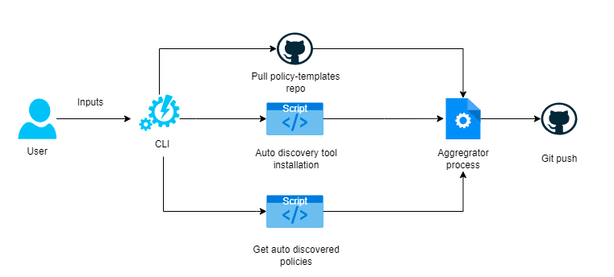
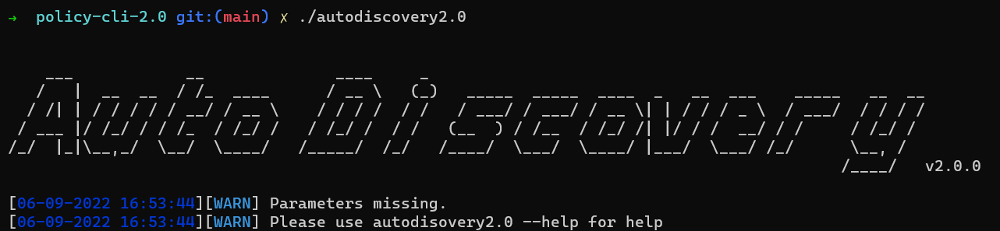
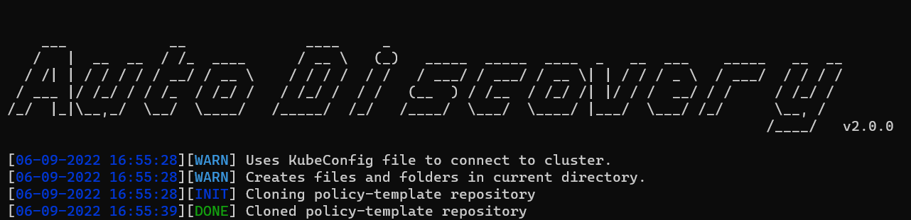
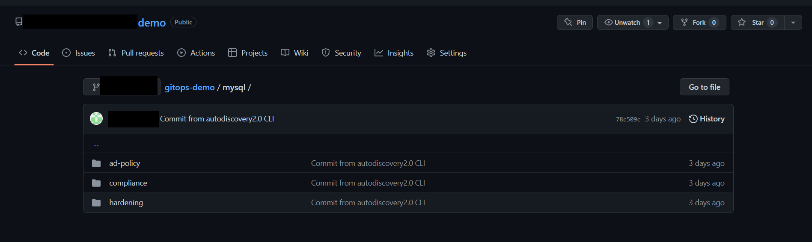

Policy Discovery 2.0
---

Policy discovery 2.0 is used to create YAML-based runtime security policies which can be enforceable by [AccuKnox](https://www.accuknox.com/) opensource tools. Policy discovery 2.0 offers auto-discovered policies based on the workloads as well as policies that are tailored for specific use cases.
We have a [dedicated repository](https://github.com/kubearmor/policy-templates) that houses various types of policies specific to CVEs, Workloads, Malware, and many more. 


## Prerequisites

To make the tool work you need to have
 - a Kubernetes cluster 
 - a configured kubectl binary 
 - go version >= 1.17.8

## How it works
The architecture is pretty straightforward. 
<h3 align="center">
  </a>
</h3>


The CLI takes in some inputs from the user and starts its action by connecting to the Kubernetes Cluster and checking for deployed workloads. Once these are identified the CLI pulls down the policy-templates repository and creates separate policy files with updated labels and namespace so that these policies are ready to be enforced on the cluster.

<h3 align="center">
  </a>
</h3>


<h3 align="center">
  </a>
</h3>


### Final Output in GitHub

 <h3 align="center">
   </a>
 </h3>

## Install autodiscovery2.0

autodiscovery2.0 requires  **go1.17 or higher**  to install successfully. Run the following commands to build the latest version-
```sh
git clone git@github.com:vishnusomank/policy-cli-2.0.git
cd policy-cli-2.0
go build -o autodiscovery2.0
```
To run the program use-
```sh
./autodiscovery2.0
```


### Usage

```sh
autodiscovery2.0 -h
```

This will display help for the tool. Here are all the switches it supports.


```console
NAME:
   Auto Discovery v2.0 - A simple CLI tool to automatically generate and apply policies or push to GitHub

USAGE:
   autodiscovery2.0 [Flags]
   Eg. autodiscovery2.0 --git_base_branch=deploy-branch --auto-apply=false --git_branch_name=temp-branch --git_token=gh_token123 --git_repo_url= https://github.com/testuser/demo.git --git_username=testuser

VERSION:
   2.0.0

COMMANDS:
   help, h  Shows a list of commands or help for one command

GLOBAL OPTIONS:
   --auto-apply, --auto                         If true, modifed YAML will be applied to the cluster (default: false)
   --git_base_branch value, --basebranch value  GitHub base branch name for PR creation
   --git_branch_name value, --branch value      GitHub branch name for pushing updates
   --git_repo_url value, --git_url value        GitHub URL to push the updates
   --git_token value, --token value             GitHub token for authentication
   --git_username value, --git_user value       GitHub username
   --help, -h                                   show help (default: false)
   --version, -v                                print the version (default: false)
```

### Running autodiscovery2.0

```sh
autodiscovery2.0 --auto-apply=false --git_branch_name=demo-branch --git_token=ghp_gittokenqwerty  --git_repo_url=https://github.com/demo-user/demo-repo.git --git_username=demo-user --git_base_branch=demo-base-branch
```

### Resources

- [AccuKnox opensource quick start guide](https://help.accuknox.com/open-source/quick_start_guide/) 
- [What is policy discovery?](https://help.accuknox.com/getting-started/policy-discovery/)
- [KubeArmor: Runtime protection for Kubernetes & other cloud Workloads ](https://kubearmor.io/) 
- [What is Cilium?](https://help.accuknox.com/open-source/what-is-cilium/) 
